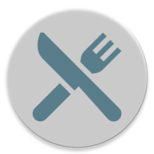

# FOOD DECIDER

Aplikacja powstała podczas kursu nauki Kotlina. 
Na kursie powstała wersja z możliwością dodawania potrawy/restauracji do listy. Następnie z utworzonej listy użytkownik losował pozycje. 
Po wyłączeniu aplikacji dane były tracone. Pomysł na aplikację bardzo mi się spodobał, więc postanowiłam aplikację te nieco ubogacić. 
W ten sposób powstała obecna wersja aplikacji. Jeśli masz pomysł jak ją ulepszyć daj znać. 
Aplikacje możesz pobrać na urzadzenie z androidem i zainstalować ją przez plik apk znajdujący się na gałęzi release. 
Jeśli nie wiesz jak zainstalować aplikacje z pliku APK zajrzyj pod ten[link](https://developer.android.com/distribute/marketing-tools/alternative-distribution#unknown-sources).
## Technologie

* Kotlin
* Shared Preferences
* GSON

## Funkcjonalności
### Dodawanie nowych potraw/restauracji
Aby dodać nową potrawę należy udać się do okna starowego i w polu tekstowym (zaznaczenie 1)
wpisać nazwę <b><u>NIE</u></b> istniejącą w spisie potraw/restauracji. Następnie użytkownik musi kliknąć w przycisk poniżej (zaznaczenie 2).
 Jeśli dana potrawa lub restauracja nie istnieje w spisie zostanie ona dodana. W innym przypadku wyświetlony zostanie stosowny komunikat.

### Przeglądanie i usuwanie dodanych potraw/restauracji
Chcąc przeglądnąć listę dodanych potraw, użytkownik musi przejść do ekranu z listą. W tym celu na ekranie głównym aplikacji, musi kliknąć w ikonę oka (zaznaczenie 1). 
Jeśli w liście potraw/restauracji nie będzie żadnej pozycji zostanie wyświetlona odpowiednia informacja. Jeśli natomiast w liście będą pozycje wyświetlą się one w tym oknie. 
Obok nazw potraw/restauracji zostanie wyświetlona ikona kosza. Która uymożliwa użytkownikowi usunięcie pozycji.

### Losowanie pomiędzy dodanymi potrawmi/restauracjami
Użytkownik na samym dole pierwszego ekranu może znaleźć przycisk "Decide!". Po kliknięcu w ten przycisk w miejscu pod ikoną wyświetli się nazwa
wylosowanej potrawy lub restauracji, która była wcześniej dodana.

#### Aplikacja jest w trakcie rozwoju
